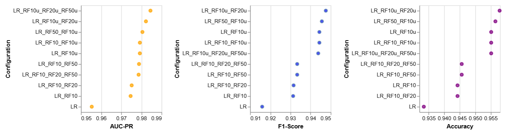
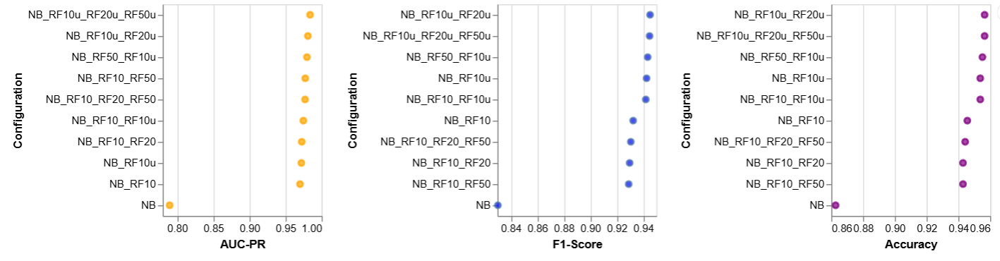
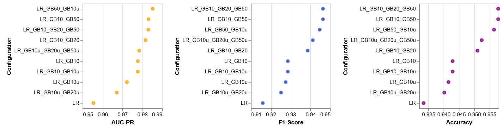
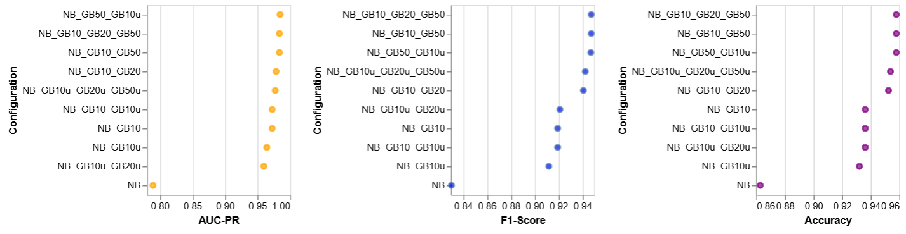
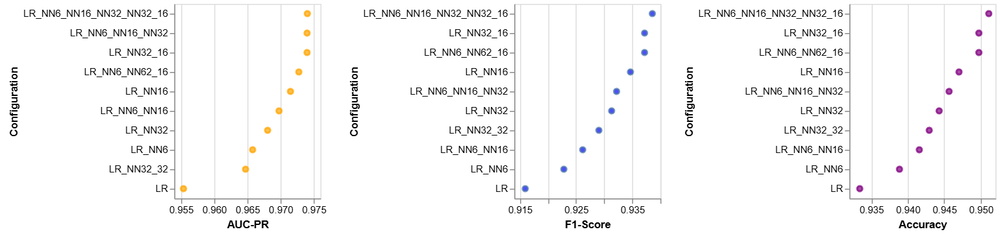
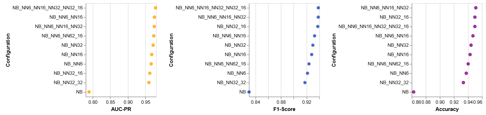
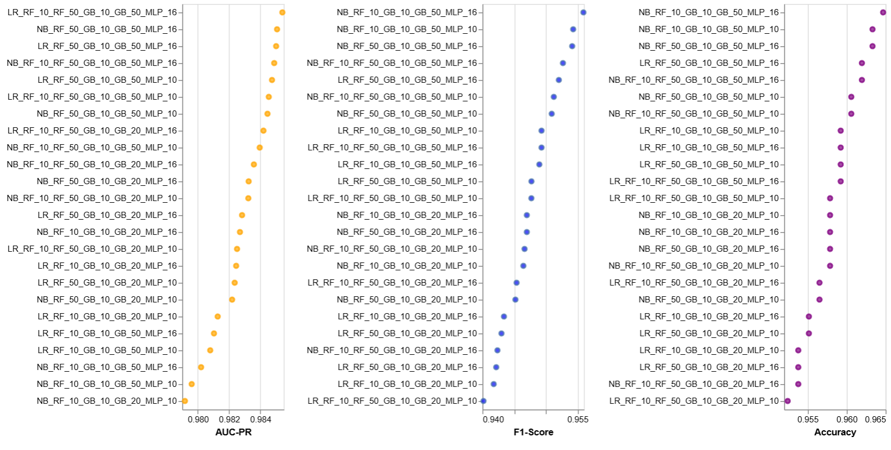
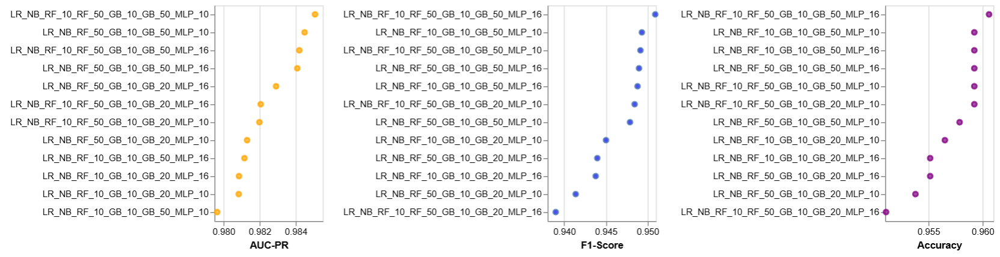
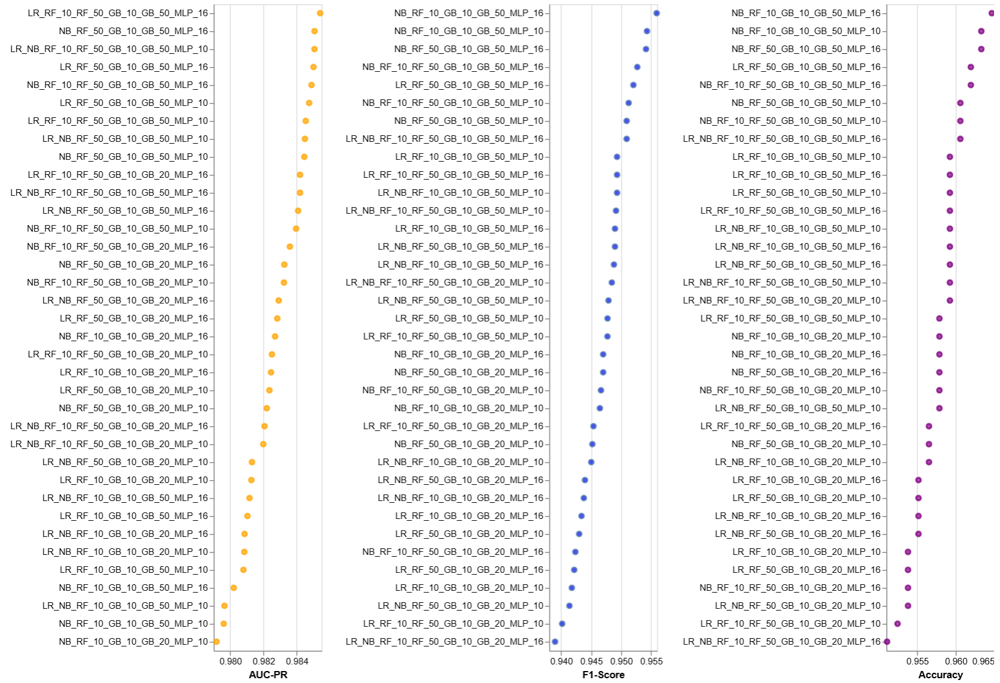

# SUPERLEARNER

Throughout the project we reference many times the paper: **Practical considerations for specifying a super learner**
https://arxiv.org/pdf/2204.06139

All of the text is part of the executable notebook where it is accompanied by relevant code and outputs (where necessary) for context.

# TODO: Maybe some feature analysis and selection + input format description
Possible to add screenshots from the code notebook or add dataset loading and analysis here

Our dataset consists of n=4601 records for to which one of two classes 0/1 (no-spam/spam) is assigned so we are dealing with binary classification.

We have followed the methodology from the paper to select a fitting choice of hyperparameters, number of folds for cross-validation and evaluation metric.

First we determined the prevalence of individual classes to detect whether there is an inbalance in their distribution.

**Records containing spam:** 1813

**Records not containing spam:** 2788

#### Computing the effective sample size n_eff (from paper)

We have binary data, the prevalence of Y is **p=class_1 / total_size**, subsequently **n_rare=n*min(p, 1-p)**, and finally **n_eff=min(n, 5*n_rare)**.

In our case **n_eff = 4601**.

#### Computing the V for V-fold cross-validation
Since n_eff >= 500 but not >= 5000 we should select a value between 20 and 10. We take in account that n_eff is closer to 5000 and so we focus on V slightly higher than 10. We chose 12.

### BASE LEARNERS - SPECIFICATION

When choosing the base learners for the first layer we have considered the properties of the dataset and the task in this case being binary classification. As the paper *Practical considerations for specifying a super learner* suggests "An ideal, rich library is diverse in its learning strategies, able to adapt to a range of underlying functional forms for the true prediction function, computationally feasible, and effective at handling high dimensional data. Diverse libraries include parametric learners, highly data-adaptive learners, multiple variants of the same learner with different tuning parameter specifications...". So the first layer should consist of diverse algorithms with different inductive biases to ensure a rich set of predictions for the metalearnerearner".

We have selected: 

**Random Forest:**

Because they are robust to overfitting on datasets with many features and they handle noisy or irrelevant features well, which is can be a thing in this case.

**Generalized Linear Model - Logistic regression:**

We chose to add it because it's a simple yet effective baseline model, especially logistic regression for binary classification. It should provide a low-variance learner to complement the other high-variance ones.

**Deep Learning (H20's MLP):**

We add the neural networks, because of it's flexibility so it could capture non-linear relationships which should broaden the diversity of the stacks prediction.

**Naive Bayes:**

Why: Spam datasets often benefit from Naive Bayes since it assumes independence among features and thus might capture something more general than the other models.

**Gradient Boosting Machines:**

We choose them as another complement ensemble method that can capture rather complex relationship and so maybe overfit more to th data.

We assume the simpler models like naive bayes and logistic regression should bring in the stack a more general view without focusing too much on the quirks in the data and to balance it out we have selected a more accurate and flexible methods like MLP

### METALEARNER - TRAINING & EVALUATION

For the metalearner we principally selected two possible options for testing:

**GLM:**

We chose logistic regression because it is simple and interpretable and as a meta-learner we want it just combine the predictions of individual learners by weighting the them reducing the risk of overfitting when combining predictions. So in this case we are more focused on finding the best combination of predictions rather than adding more complexity.

**Gradient Boosting Machine / MLP:**

As an alternative second option we would suggest something stronger, a bit of a bigger hammer sort to say, especially for our stacks which are more diverse in which case their predictions could be more complex, so they could capture non-linear relationships among them. Due to computational demands (and mostly time) we tested this option only on some representative selection and the best performing combinations from the point 1.

**Evaluation metrics:**
In accordance with the paper where our task is binary classification of imbalanced classes we chose AUCPR as a primary evaluation metric. In addition as alternatives we provide F1 (once again due uneven class distribution) and finally accuracy as complement.

# Ablation studies

We also tried various configurations of hyperparameters for each class of learners as the paper specifies: *"Since the true functional form is unknown, it is a good idea to consider a variety of base learners, and to construct multiple variations of the same base learner with different tuning specifications. There is no harm in including a learner that performs poorly in the library, as it will be given a weight of zero..."* (or close to 0).

In the following we tried a more methodological way of building the stack. 
We identified two approaches for which their effects could be evaluated on the final test metrics:

**1) Building the stack from simpler models adding more complex ones:**

In this method we start from a base consisting of simple models which we assume would capture the main / most general pattern in the data.
Afterwards we gradually try adding more complex models to extend the stack capabilities to capture more finer intricacies and more complex (perhaps non-linear) relationships in the data and we observe the effect on the test metrics.

**1) Building the stack from more complex models adding more general/simple ones:**
In this method we start from a base consisting of more complex models which we assume would capture the complex relationships in data well and then
we try to bring down the variance by adding simpler models that don't overfit to the data so much.

Due to computational demands we have decided to test only the first one.

##### We also note that a more efficient variant would be training each model only once in case it is present in multiple combinations.

Due to the tradeoff between the scope of this project and time capabilities we perform only superficial overview. If the problem would be a topic of major research where the time needed to search the vast hypothesis space is available, we would suggest performing more extensive per-class tests with higher hyperparameter sampling granularity to better observe how they affect the models performance.

# Simple to complex

To try all possible combinations would be computationally unfeaseble. Therefore we chose a more naive tactic, where we examine the combination of a 
simple learner with the a few representative selections of a single class of complex learners and we choose the best performing options for combinations with others. There is a notebook with the ablations for each of the more complex learner classes we used (RF, GBM, MLP).

# Results of the ablations

Our goal for each class was to select one options which probably overfits more, one which provides a good tradeoff between the overfitting and complexity and one which performs the most poorly hoping it might be less overfit (but all of them except for the primitive variants (NB/LR) obtain high scores so it is not such a difference).

## Random Forest
**LEGEND EXPLANATION:**

**LR** - Logistic Regression
**RFX** - Random Forest X trees (max depth=10)
**RFXu** - Random Forest X trees (unbounded depth)
**NB** - Naive Bayes

### Logistic Regression as a base simple model

### Naive Bayes as a base simple model

From RF's class we have selected the configurations:

But we went with:
**RandomForest 10 trees with depth 10 - RandomForest 50 trees with depth 10:**
We have noted a visible drop (especially for LR) for the AUC-PR and F1 metrics between the unbounded and depth bounded trees. For this reason we selected the variant with bounded depth which performed among the best withing unbounded variants (or equally well in some cases as the most complex one).

**RandomForest 10 trees with depth 10:**
For our most simple version we selected random forest with 10 bounded trees because even though it is the simples configuration it sometimes performs better than the more complex 10_20 one.

Originally we were considering also this option:

**RandomForest 10 trees unbounded depth - RandomForest 50 trees with depth 10:**
After consulting the AUC-PR and F1-Score it is one of the best performing variants even though it is not one of the most complex ones.

In it's place we added option of **RandomForest 50 trees with depth 10:** as that is what we would try first hand in non-superlearner setting.

## Gradient Boosting
**LEGEND EXPLANATION:**

**LR** - Logistic Regression
**GBX** - Gradient Boosting X trees (max depth=10)
**GBXu** - Gradient Boosting X trees (unbounded depth)
**NB** - Naive Bayes

### Logistic Regression as a base simple model

### Naive Bayes as a base simple model

From GB class we have selected the configurations:

**GradientBoosting 10 trees with depth 10 - GradientBoosting 50 trees with depth 10:**
From the AUC-PR and F1-Score metrics it is one of the best performing variants even though it doesn't contain the model with unbounded depths.

**GradientBoosting 10 trees with depth 10 - GradientBoosting 20 trees with depth 10:**
In this class we are selecting only two options (to minimize overall complexity) as it seems that there is a visible drop between simple variants of 10 bounded trees and 10_20 bounded trees.

## MLP
**LEGEND EXPLANATION:**

**LR** - Logistic Regression
**NNX** - MLP with X neurons in 1 hidden layer
**NNX_Y** - MLP with X neurons in 1st hidden layer and Y neurons in 2nd hidden layer
**NB** - Naive Bayes

### Logistic Regression as a base simple model

### Naive Bayes as a base simple model

**NOTE there is a mistake in labels where NN62 should be NN32*

From MLP class we have selected the configurations:

**MLP 16 neurons in single hidden layer:**
From the AUC-PR and F1-Score metrics we can see that model performs comparable well to double layers MLPs yet with an advantage of significantly reduced complexity.

**MLP 10 neurons in single hidden layer:**
Not in testing samples but in between 10-16 as we wanted to avoid overfitting too much and the poorer perfomance of 6 neurons in some setting.

## Results achieved from combinations built on single primitive model (LR, NB)

 

## Results achieved for mix of two models

 

## And combined results

 

We must note that all of the models perform comparably with the differences being minuscule. Even still we selected a subset of representative examples.
From the following results we select:

**Naive Bayes + Random Forest 50 trees + Gradient Boosting 10 trees + Gradient Boosting 50 trees + MLP with 16 neurons in 1 hidden layer** as second best performing (yet not the most complex) model according to the AUC-PR metric.

**Naive Bayes + Random Forest 10 trees + Gradient Boosting 10 trees + Gradient Boosting 50 trees + MLP with 16 neurons in 1 hidden layer** as the best performing according to the F1 and Accuracy scores.

**Naive Bayes + Random Forest 10 trees + Gradient Boosting 10 trees + Gradient Boosting 50 trees + MLP with 16 neurons in 1 hidden layer** as the best performing according to the F1 and Accuracy scores.

**Logistic Regression + Random Forest 10 trees + Gradient Boosting 10 trees + Gradient Boosting 50 trees + MLP with 16 neurons in 1 hidden layer** as the model well balancing all the metrics.

Additionaly we add a **simple stack** without tuned hyperparameters consisting of one version of each learner.

## Final overview of this representative sample comparing GLM and Neural Network as choice of metalearner

 

Even though deeplearning metalearner performs the best on AUC-PR we choose the model **Naive Bayes + Random Forest 50 trees + Gradient Boosting 10 trees + Gradient Boosting 50 trees + MLP with 1 hidden layer with 16 neurons** as the model which best balances all metrics but primarily performs among the best on AUC-PR and F1-Score.

## The estimation of generalization error on the final (until now unseen) test data

#### **AUC-PR:** 0.9749
#### **F1-Score:** 0.9537
#### **Accuracy:** 0.9598

Results are comparable with what we observed on the validation set.

## Conclusions & Observations

* We note that as expected choice of a single simple model LR or NB performed significantly worsed compared to any other stack.

* Stacks in general surpassed the results of the individual methods although the change was not too big so the original base learners probably manage to 
capture the relationships in the data well enough.

* In the AUC-PR and F1-Score metrix which we have selected to account for inbalanced classes, most of the stacks perform very pretty similarly on AUC-PR with highest differences present in F1-Score results. In terms of accuracy they also varied minimally.

* Even though we have inbalanced dataset accuracy is not significantly worse than the other metrics that take in account the inbalance.

* High AUC-PR should signify that method manages very well the classification of the minority class - in this case spam.

* High F1 also means it balanced pretty well precision and recall although in real life false positives and false negatives might not have similar consequences and we might focus more on rather not detecting good email as spam.

* Suprisingly the inclusion of both simple methods (NB and LR) didn't significantly improve the results or perform in general better than the single simple method combinations.

* The best stack combines Random Forest and Gradient Boosting, both with 50 trees which are both the default configurations that we would select if using these methods in separate.

* Depth unbounded tree based ensembles performed worse in general compared to the ones bounded with max tree depth 10.
